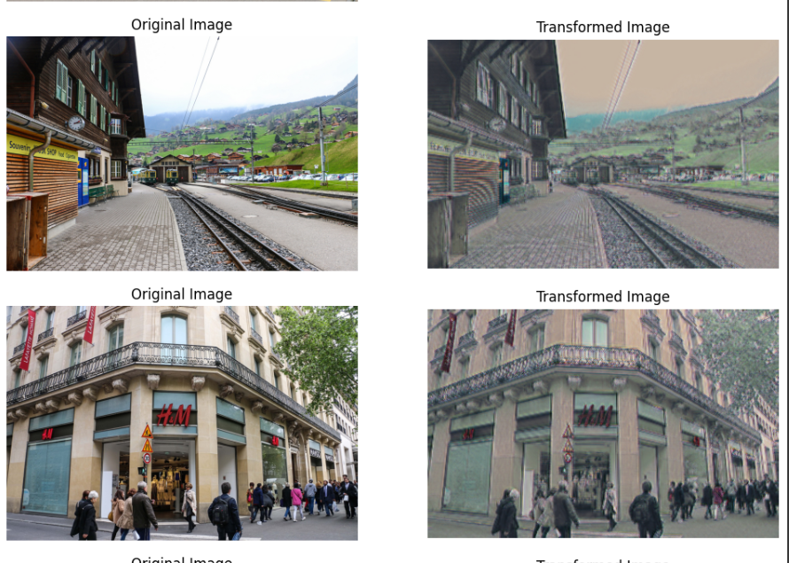

# AnimeGAN Pytorch <a href="https://colab.research.google.com/github/Affog7/Gan-anim/blob/main/notebooks/animeGAN.ipynb" target="_parent"></a>


# AnimeGAN

AnimeGAN is a deep learning model for transforming real-life photos into anime-style images using Generative Adversarial Networks (GANs).

## Prerequisites

- Python 3.x
- Google Colab (for cloud-based execution)
- PyTorch
- CUDA (for GPU support)

## Installation

1. Clone this repository:

   ```bash
   git clone https://github.com/Affog7/Gan-anim


2. Install required dependencies:

    ```bash
    pip install -r requirements.txt

3. Dataset utilisé pour l'entrainement et test: 
  https://github.com/ptran1203/pytorch-animeGAN/releases/download/v1.0/dataset_v1.zip


## USAGE 

* Training
    ```bash
    !python3 train.py --real_image_dir '/content/dataset/train_photo'\
                  --anime_image_dir '/content/dataset/Hayao'\
                  --batch 8\
                  --model v2\
                  --amp --cache\
                  --init_epochs 10\
                  --exp_dir {working_dir}\
                  --gan_loss lsgan\
                  --init_lr 0.0001\
                  --lr_g 0.00002\
                  --lr_d 0.00004\
                  --wadvd 300.0\
                  --wadvg 300.0\
                  --wcon 1.5\
                  --wgra 3.0\
                  --wcol 70.0\
                  --use_sn


* Inference (To transform an image or video) :
  
    Image

    ```bash
    python3 inference_image.py --checkpoint /path/to/model.pt\
                            --src /path/to/input/images\
                            --dest /path/to/output/images


 *  Video

        ```bash
        python3 inference_video.py --checkpoint /path/to/model.pt\
                                --src /path/to/input/video.mp4\
                                --dest /path/to/output/video.mp4

                        
## Resultats

* Image vs Images animées

    

* Video Animée

    <a href="./Video/giphy.mp4"> Vidéo originale </a>
    <a href="./results/test_vid_3_anime.mp4"> Vidéo animée </a>

* Modèle généré

    <a href="/Models_genere/GeneratorV2_train_photo_Hayao.pt"> train_photo_Hayao </a>
    <a href="/Models_genere/discriminator_train_photo_Hayao.pt"> discriminator_train_photo_Hayao </a>
    <a href="/Models_genere/GeneratorV2_train_photo_Hayao_init.pt"> GeneratorV2_train_photo_Hayao_init </a>